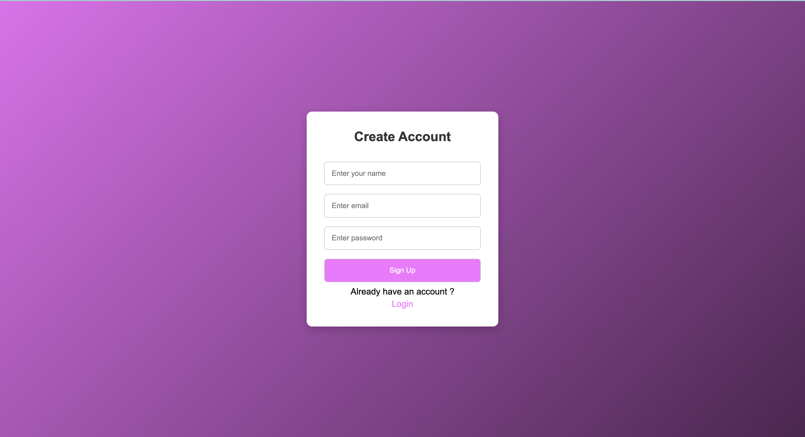
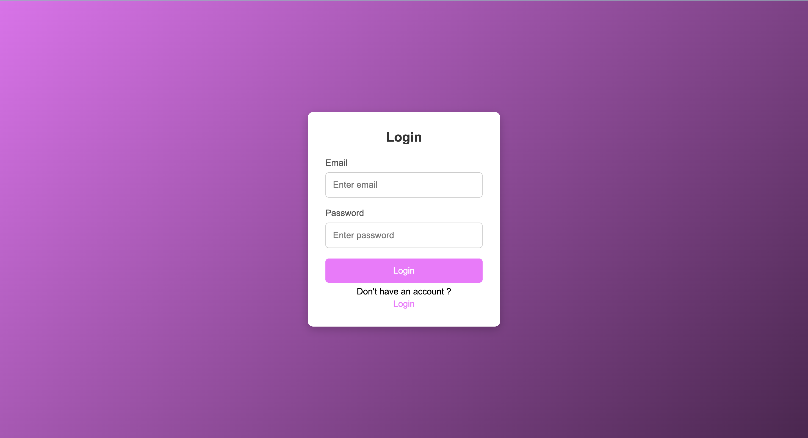

🌐 Yoh!Chat – Real-Time Chat Application

A full-stack real-time chatting system built using HTML, CSS, JavaScript, Node.js, Express, MongoDB, and Socket.io, with secure authentication powered by JWT.

This project was developed by a BCA 3rd-year student with the help of ChatGPT, focusing on learning full-stack development, authentication systems, and real-time communication.

🚀 Features
✅ User Authentication

Signup & Login

Password hashing using bcrypt

Secure JWT token-based authentication

Access control for all chat functionalities

💬 Chat Functionalities

Public chat room

One-to-one private messaging

Real-time message updates using Socket.io

Typing indicator

Online users list

Auto-scroll

Last seen tracking

Message timestamps

🗂 Database Features (MongoDB)

Stores users

Stores public chat messages

Stores private chat messages

Tracks message timestamps & read/unread status

🎨 UI/UX

Fully responsive layout

Modern chat UI with message bubbles

Left/right alignment of messages

Smooth animations

Bootstrap + custom CSS theme

🏗 Tech Stack
Layer	Technologies
Frontend	HTML, CSS, Bootstrap, JavaScript
Backend	Node.js, Express.js
Realtime	Socket.io
Database	MongoDB
Security	JWT, bcrypt
Tools Used	VS Code, Postman, MongoDB Compass
📁 Project Structure
/project-root
│── /public
│   ├── index.html
│   ├── login.html
│   ├── signup.html
│   ├── style.css
│   └── /Assets/js/app.js
│
│── /models
│   └── User.js
│
│── /routes
│   └── auth.js
│
│── server.js
│── .env
│── package.json
│── README.md

🔐 Authentication Flow

User signs up → Password hashed using bcrypt

User logs in → Credentials validated

Server issues a JWT token

Token is stored in browser localStorage

Token is used to authenticate Socket.io connection

Unauthorized users cannot enter the chat

⚡ Real-Time Messaging Flow
Public Chat

User sends message

Message saved to MongoDB

Broadcast to all users instantly

Private Chat

User clicks another user → loads chat history

Messages stored separately in PrivateMessage collection

Sent directly to the target socket

Marked as read when opened

🧩 Environment Variables (.env)
MONGO_URI=mongodb://127.0.0.1:27017/yohchat
JWT_SECRET=superSecretKey123

▶️ How to Run the Project Locally
1. Clone the repository
git clone https://github.com/username/yohchat.git
cd yohchat

2. Install dependencies
npm install

3. Start MongoDB

Make sure MongoDB is running locally:

mongod

4. Start the server
node server.js

The app will run at:

http://localhost:3000

📌 Key Learning Outcomes.

Implementing secure login using JWT

Handling real-time communication using Socket.io

Designing a scalable backend architecture

Working with MongoDB queries & models

Building a responsive and animated UI

Managing both public and private chat systems

📸 Screenshots.

Sign up page:

Login Page:

Public Chat:

Private Chat:

🛠 Future Improvements

Add image/file sharing

Add group chats

Add message delete/edit options

Push notifications

Deploy on cloud (Render / Vercel / Railway)

🙌 Acknowledgements

This project was developed with the support and guidance of ChatGPT, especially for debugging, optimizing code, and designing backend architecture.

⭐ Author

Misbahudeen MT
BCA 3rd Year Student | Full Stack Learner
(https://www.linkedin.com/in/misbahudeenmt/)